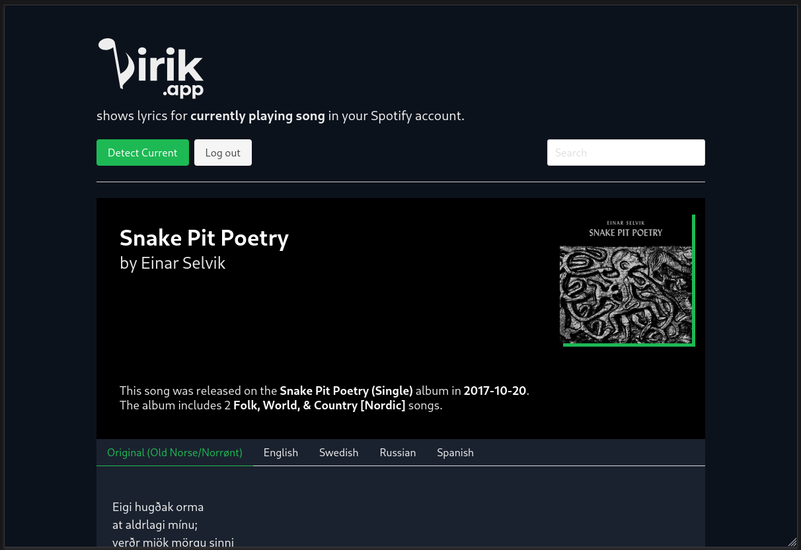

	
	

		<strong><code>v0.7.0</code></strong> 
		Lyrics for Spotify
	

## What 

Shows lyrics for currently playing song in your Spotify account.

## Features

**Autodetect**  
Automaticly detects currently playing song in your Spotify account.

**Translations**  
Shows translations for the lyrics.

**Meta**  
Shows additional informations for the song.

**Fast**  
Uses server side caching to improve the performance. By using this you make the site even faster.

**Clean**  
Simplest UI. Just open the site and see the lyrics.

**No installation**  
You don't need to install anything. Simply use it in your browser, in any device.

**No money charge**  
Free, forever.

## Preview

	

## Credits

Lirik.app uses Genius and Lyricstranslate as resources.
